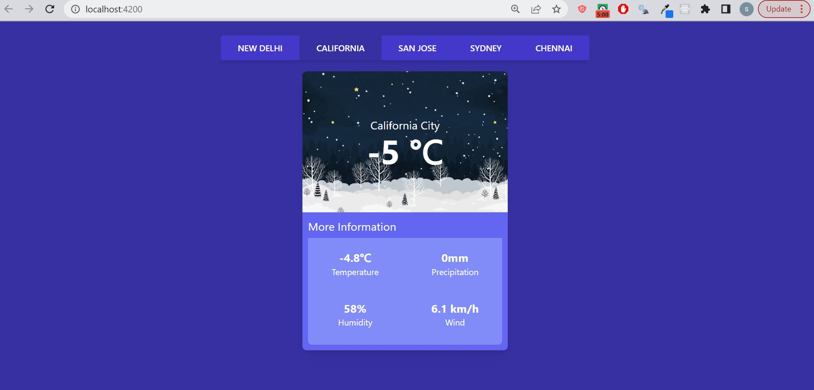

# WeatherApp

Simple weather application to practice angular concepts. Used rapid API to fetch weather
conditions of specified cities.
Snapshot of the application:

This project was generated with [Angular CLI](https://github.com/angular/angular-cli) version 14.2.4.

## Development server

Run `ng serve` for a dev server. Navigate to `http://localhost:4200/`. The application will automatically reload if you change any of the source files.
